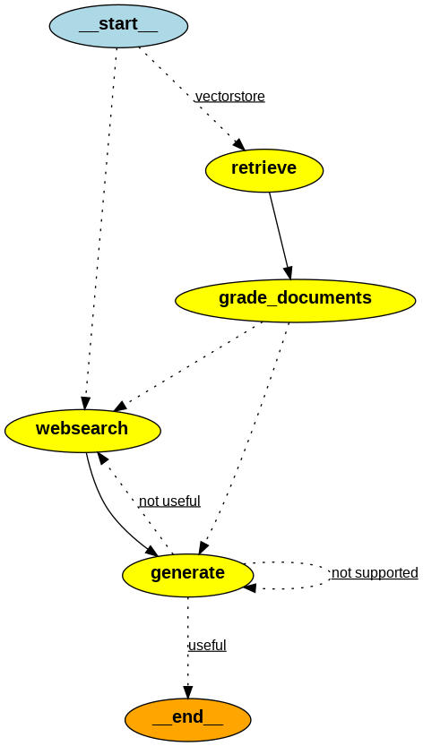

# ⚡ Reliable RAG Pipeline — High-Accuracy Retrieval-Augmented Generation

## 🧠 What is Reliable RAG?

**Reliable RAG** is an enhanced Retrieval-Augmented Generation pipeline designed to produce **accurate, grounded, and trustworthy responses** by combining:

* ✔ High-quality embeddings
* ✔ Strong document retrieval
* ✔ LLM-based document relevance grading
* ✔ Post-generation hallucination detection

Unlike traditional RAG — which simply retrieves chunks and feeds them to an LLM — **Reliable RAG adds two validation layers** to ensure correctness at both the input and output stages.

It is ideal for:

* Knowledge bases
* Research assistants
* Document Q&A systems
* Legal, scientific, or enterprise settings
* Any environment where hallucinations are unacceptable

---

## 🔍 Advantages Over Traditional RAG

Traditional RAG is useful, but it has some major weaknesses.

The table below shows how **Reliable RAG fixes them**:

| Problem in Traditional RAG                         | How Reliable RAG Fixes It                             |
| -------------------------------------------------- | ----------------------------------------------------- |
| Retrieves incorrect or semantically weak documents | LLM-based relevance grading filters irrelevant chunks |
| Allows hallucinated answers                        | Hallucination detection verifies grounding            |
| No quality control                                 | Dual evaluation: retrieval grading + output grading   |
| Depends completely on vector similarity            | Adds reasoning-based semantic validation              |
| Opaque pipeline                                    | Transparent logs at each stage                        |

### ✔ Reliable RAG = Controlled + Verified + Accurate

By validating both retrieved documents *and* final outputs, Reliable RAG significantly reduces errors and produces **trustworthy responses consistently**.

---

# 📘 Project: Reliable RAG with LangChain, Chroma, HuggingFace & Groq

This project implements a fully verified **Reliable RAG** pipeline using:

* 🌐 Web document ingestion (WebBaseLoader)
* ✂️ Smart text splitting (RecursiveCharacterTextSplitter)
* 🔤 HuggingFace MiniLM embeddings
* 🗂️ Chroma vector database
* 🚀 Groq Llama 3.1 LLM for relevance grading & answering
* 🛡️ Hallucination detection using an additional Groq LLM pass

The goal is to build a RAG system that is not just functional —
but **robust, validated, and dependable**.


---



# 🚀 Features

### 1️⃣ Web Scraping & Document Loading

Automatically loads multiple DeepLearning.ai articles on Agentic Design Patterns.

### 2️⃣ Smart Document Chunking

```
chunk_size   = 1000
chunk_overlap = 200
```

Optimized for context retention.

### 3️⃣ High-Quality Embeddings

Uses: **sentence-transformers/all-MiniLM-L6-v2**
Fast, lightweight, and highly accurate.

### 4️⃣ Chroma Vector Store

Efficient, persistent similarity search.

### 5️⃣ LLM-Based Relevance Grading

Each retrieved chunk is validated by a Groq-hosted LLM.

### 6️⃣ Final Answer Generation

Concise, factual responses using **Llama 3.1-8B (Groq)**.

### 7️⃣ Hallucination Detection

Ensures the generated answer is grounded in provided documents.

---

# 📦 Installation

```bash
pip install -r requirements.txt
```

---

# 🔧 Environment Setup

Create a `.env` file:

```
GROQ_API_KEY=your_api_key_here
```

---

# 🧪 Workflow

1. Load URLs
2. Extract text
3. Split into chunks
4. Create embeddings
5. Store in Chroma
6. Retrieve top-k chunks
7. LLM relevance grade
8. Filter non-relevant chunks
9. Generate final answer
10. Run hallucination checker

---

# 📝 Output

Pipeline will produce:

* Retrieved documents
* Relevance grading scores
* Final validated answer
* Hallucination detection result

---
